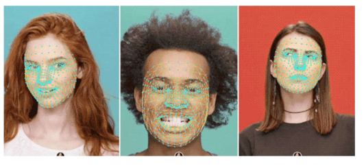
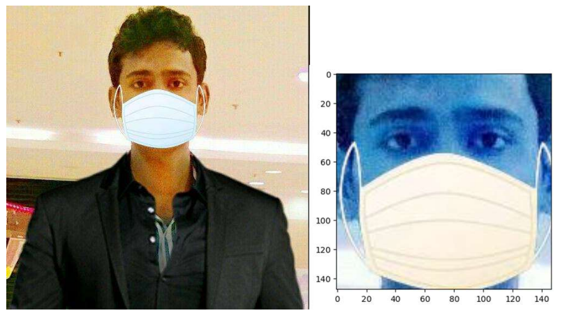
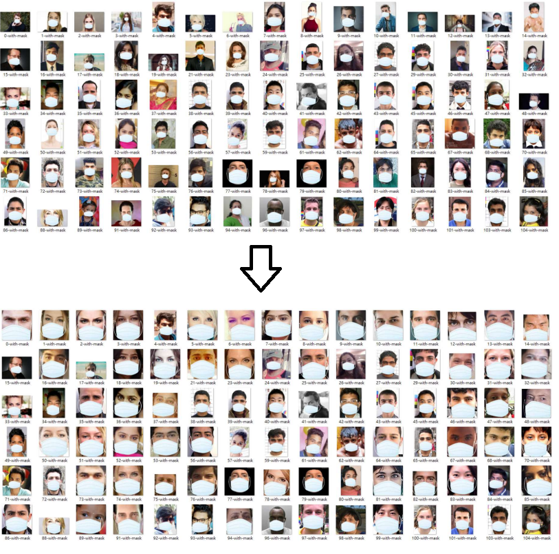
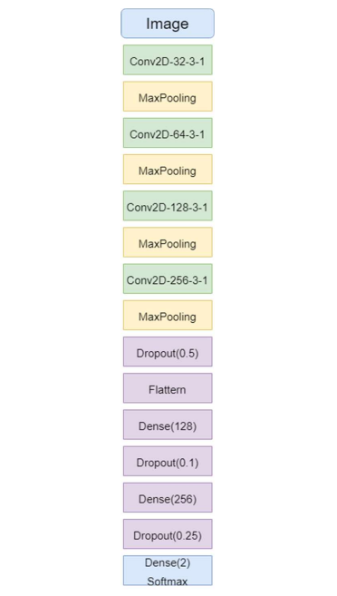
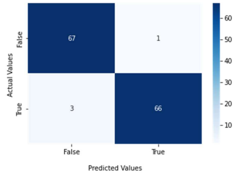

# Overview

This is the overview of "Face Mask Detection with Machine Learning", a small project for the course COMP4211 of The Hong Kong University of Science and Technology in 2022-2023.

## Introducttion

During the Covid-19 pandemic, wearing masks has become a must for going outdoors in Hong Kong. According to the Prevention and Control of Disease Regulation [1], citizens are required to wear masks in the majority of public areas or else need to pay a fixed amount of penalty. Hence, resources are invested in monitoring people whether they are wearing masks or not.

To facilitate the monitoring, this project aims to implement a model which can classify whether people are wearing masks or not. Face recognition will first be done to extract the face part in the image to eliminate all unnecessary components in the image. Then, a Convolutional Neural Network will be constructed and trained with the dataset provided. The classifier at the end will predict the label of each test sample. The project will evaluate the model with different hyperparameters and methods to achieve the best accuracy.

## Dataset and data pre-processing

In the dataset, it provided 686 non-masked face images, and 690 masked face images. Before processing into the model training stage, the raw data needed to be pre-processed to prevent any other factors, including background or objects, to interfere with the feature selections. Face recognition is done for extracting the faces from the raw images.

The first attempt is using the OpenCV with the Haarcascade model [2] to extract the face from the sample. However, after tuning the hyperparameters and using different models, the results are not accurate and most of the time unrelated pixels are extracted. Considering the low accuracy, this attempt has been considered a failure.

The second attempt is using the MediaPipe model [3] to extract the faces from the sample. Different from the previous attempt, the model accurately detects the face regions using 3D facial key point estimation, facial features or expression classification, and face region segmentation. There are still images that cannot be extracted by the models. However, these cases will be a minority, and hence the original photo will be processed as the cropped face.

After cropping out the faces from the raw dataset, they are stored into three subfolders (train, valid, and test folder) in ‘/data’ folder. 80% of the data will be used in training and 10% will be used in validation. After training the model, the remaining 10% of the data will be used for testing the model and evaluating the accuracy of the model trained.

## Machine learning tasks
During the data preprocessing stage, MediaPipe is used aforementioned. The machine learning pipelines in MediaPipe Face Mesh consist of two real-time deep neural network models. One is computing the face location and the other is predicting the approximate 3D surface landmark via regression. It can infer the 3D facial surface with a 2D image by estimating 468 3D face landmarks.

For the model used in training, a sequential CNN model is constructed, with Conv2D layer, MaxPooling Layer, Flattern Layer, Dropout Layer, and Dense Layer. The architecture is shown as the following:

The last layer will be a softmax function which outputs the two probabilities corresponding to the two classes.

For the dataset part, in light of the small dataset, ImageDataGenerator has been used for generating batches of tensor image data with real-time data augmentation. [4] Three generators have been created. A training generator and validation generator have been used in the training process, and the test generator is used to predict and evaluate the model afterward. Images are also resized to 150x150 before training the model.

For the training section, the Adam optimizer and the sparse categorical cross-entropy loss function have been used. The epoch has been set to 10 to prevent overfitting while attaining a good accuracy.

## Methodology

Tensorflow and keras are used in building and training the recognition model. Google collaboration is used during the training process with the GPU provided.

Throughout the whole project, sequential CNN from Keras is used for training the model. Each convolutional layer contains a set of filters, and the output represents a feature. After passing the images into the model during the training process, parameters will be updated in each filter. As a result, features will be extracted from the image after each layer of the convolutional map. Each pooling layer does not contain any learnable parameters, it is used to reduce the number of trainable parameters for the next layers. In the project, the max pooling layer is used for finding the maximum value in each patch. The dropout layer is used to avoid overfitting in the network. The last softmax function in the model of this project is used to calculate a vector of probability. By comparing the higher probability, the prediction from the model can be computed.

## Experiments and results

The result of training is as shown in the following. The accuracy of the validation set is higher than 0.9, and the loss value is around 0.1. Moreover, using the test set to evaluate our final trained model, it can attain 97% accuracy. The confusion matrix is shown as follows. There are only a few false positives and false negatives, and the majority are true positives and true negatives.

## Reference

[1] https://www.elegislation.gov.hk/hk/cap599I!en

[2] https://github.com/opencv/opencv/tree/master/data/haarcascades

[3] https://google.github.io/mediapipe/solutions/face_detection.html

[4] https://www.tensorflow.org/api_docs/python/tf/keras/preprocessing/image/ImageDataGenerator

## Project Information

##### Topic Full Name

- Face Mask Detection with Machine Learning

##### Member
- NG Chun Fung (https://github.com/cfngai)
